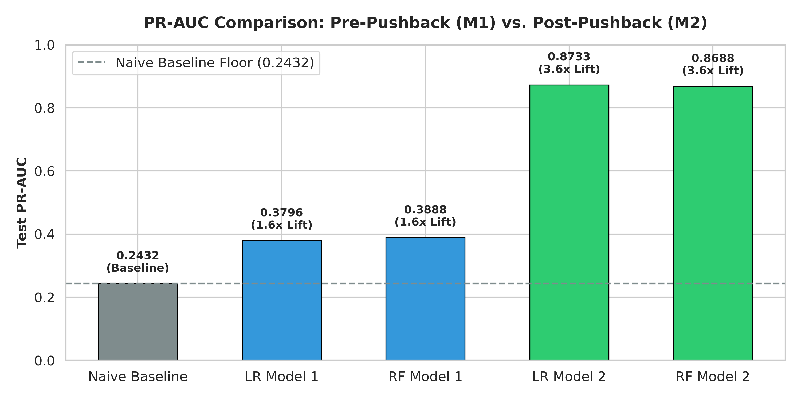
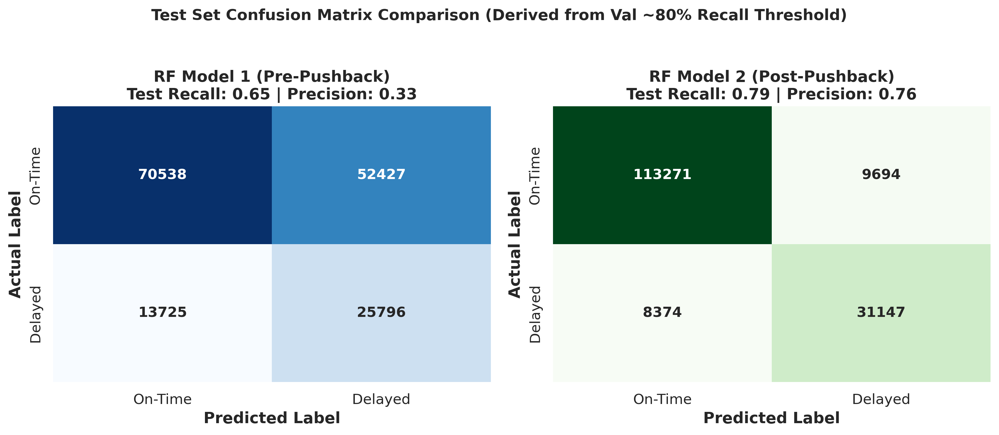
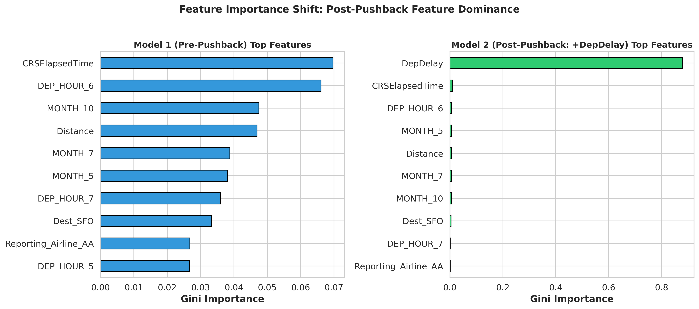
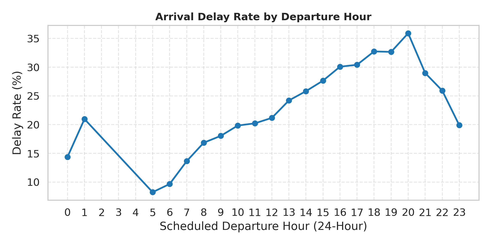
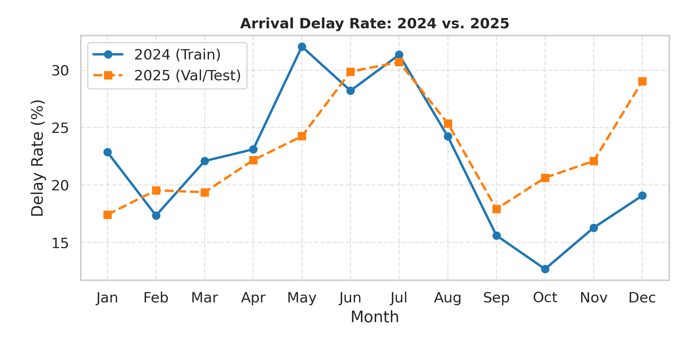

# Flight Delay Prediction

Predicting whether a US domestic flight will land 15+ minutes late using only
information that's available **before the plane leaves the gate**.

## The core idea

The project trains two versions of the same model, and the gap between them is
the actual point of the project.

- **Model 1 (Pre-Pushback):** knows only what's knowable before the aircraft
  moves (the carrier, the route, the day, the time of day). This is the
  useful, real-world model: the one you'd actually want for planning ahead.
- **Model 2 (Post-Pushback):** identical to Model 1, but with one extra piece
  of information added — how late the plane actually left the gate
  (`DepDelay`).

*("Pushback" is the moment ground crew push the aircraft away from the gate.)*

Comparing these two models answers a simple question: **how much of "will
this flight land late" is really just "did it already leave late?"** The
answer turns out to be: a lot. See Finding #2 below.

## The data

- **Source:** US Department of Transportation, reporting carrier on-time performance records
- **Time period:** all of 2024 (training) + 2025 (validation and testing)
- **Scope:** 4 major carriers (American, Delta, United, Southwest), 10 major
  hub airports (ATL, ORD, DFW, DEN, LAX, JFK, SFO, SEA, CLT, MSP), flights **only
  between** these hubs
- **Size:** ~636,000 flights after cleaning
- **Target:** did the flight land 15+ minutes late? (true for about 23% of
  flights)

## Results

### Which model catches delayed flights with the fewest false alarms?

PR-AUC is the primary metric here. With only 23% of flights delayed, plain
accuracy is misleading, since always guessing "on time" already scores 77%:

| Model | Test PR-AUC | Lift over guessing |
|---|---|---|
| Naive guess (just the average) | 0.243 | — |
| Logistic Regression — Model 1 | 0.380 | 1.6x |
| Random Forest — Model 1 | 0.389 | 1.6x |
| Logistic Regression — Model 2 | 0.873 | 3.6x |
| Random Forest — Model 2 | 0.869 | 3.6x |



### What happens if you use this to actually flag flights?

A decision threshold was picked on the validation set to catch about 80% of
real delays, then applied once to the test set:

| Model | Precision | Recall | F1 |
|---|---|---|---|
| Random Forest — Model 1 | 33% | 65% | 0.44 |
| Random Forest — Model 2 | 76% | 79% | 0.78 |



### What is each model actually paying attention to?



## Key findings

1. **Both models beat guessing by a wide margin**, even the "real" model
   (Model 1) that has to work without knowing anything about the flight's
   actual departure. It is 1.6x better than a naive guess, using nothing but the
   schedule.

2. **Knowing departure delay basically hands the model the answer.**
   `DepDelay` alone makes up 88% of what Random Forest relies on in Model 2,
   while every other feature barely registers. It shows exactly
   how much a problem changes once you cross from "predicting ahead of time"
   into "reacting to something that already happened." It's a clean,
   deliberate demonstration of the kind of shortcut a model can take if you
   let it see information it shouldn't have yet.

3. **Time of day matters a lot, even without knowing anything about the
   actual departure.** A flight scheduled for 8pm is roughly four times more
   likely to land late than one scheduled for 5am. Delays clearly build up
   over the course of the day.

   

4. **Random Forest barely beats simple Logistic Regression** in either
   model. It suggests the real patterns in this data are mostly simple,
   additive, linear effects (later in the day = worse, summer = worse) rather
   than complicated hidden combinations of features that only
   a more flexible model could find.

5. **Month matters, but its exact strength shifts from year to year**, most noticeably December,
   which was much worse in     2025 than in 2024. Since
   the model only ever learned from 2024's (milder) December, it likely
   underestimates risk for December flights specifically.

   

## What was left out

These were considered but not built:

- A feature tracking each airline's recent delay history per route
- A feature tracking how late an aircraft's previous flight that day was
- Weather data

## Project structure

```
01_data_ingestion.py       Downloads and cleans raw flight records
02_EDA.py                  Explores the data, produces exploratory charts
03_features.py             Builds the model-ready feature table
04_modeling_evaluation.py  Trains, tunes, and evaluates both models
05_visualize_results.py    Produces the results charts above

data/                      Cleaned data and feature table
figures/results/           Model results charts
figures/eda/               Exploratory data analysis charts
results/final_benchmarks.json   All metrics, thresholds, and feature importances
```

See `METHODOLOGY.md` for the full reasoning behind every design decision,
including the ones that didn't work on the first try.
